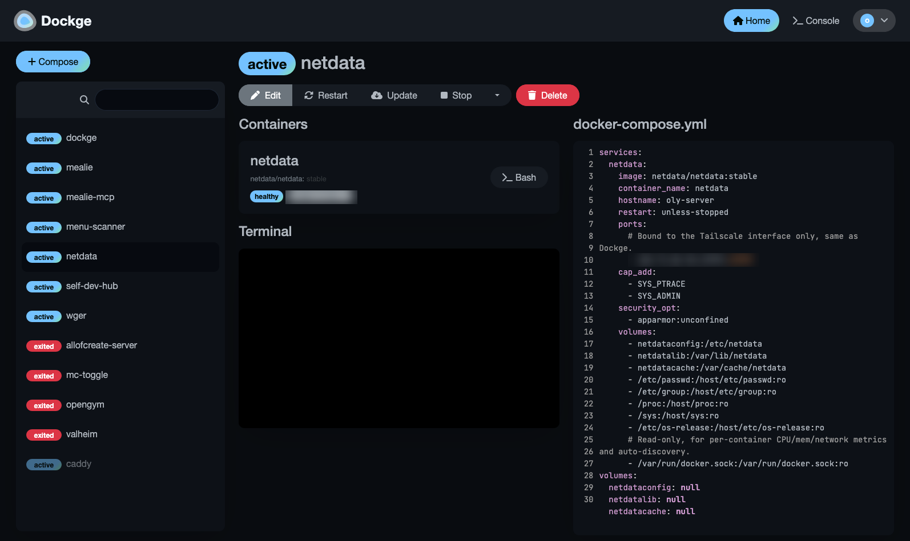
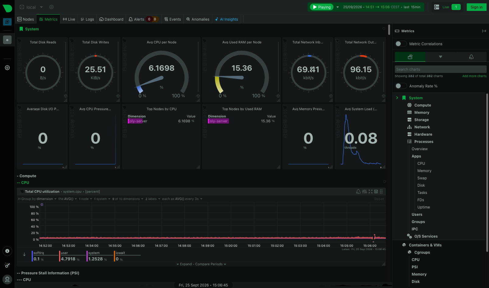
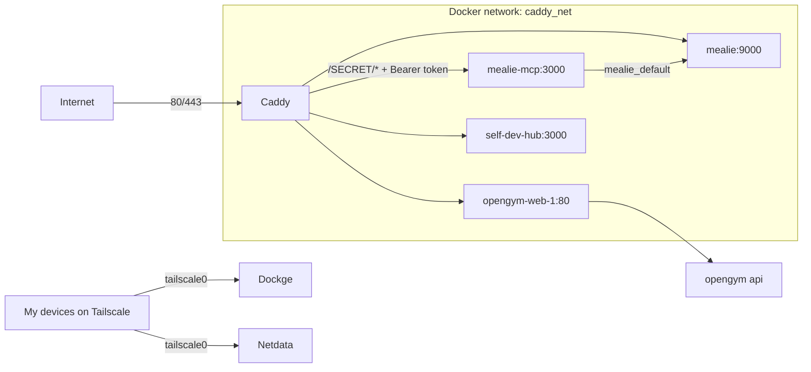

# Homelab

Docker Compose stacks and config for the services I self-host on a single Debian 13 machine at home. Caddy terminates HTTPS for the public services. Admin and monitoring tools are only reachable over Tailscale.

I wanted to properly learn self-hosting, and I liked the idea of giving older hardware a new job. The server is where I try ideas out: if something needs hosting, I can have it running behind Caddy and Tailscale in minutes. It's also a good excuse to spend more time in Linux.

| Dockge (stack management) | Netdata (monitoring) |
|---|---|
|  |  |

## What runs here

| Stack | What it is | Reachable via |
|---|---|---|
| `caddy` | Reverse proxy with automatic HTTPS | Public, ports 80/443 |
| `mealie` | [Mealie](https://github.com/mealie-recipes/mealie) recipe manager and meal planner | Public through Caddy |
| `mealie-mcp` | [mealie-mcp-ts](https://github.com/counterbeing/mealie-mcp-ts) MCP server for AI assistants to use Mealie Public through Caddy, behind a secret path prefix and a bearer token |
| `opengym` | [openGym](https://gitlab.com/DuarteSantos8/opengym) workout tracker | Public through Caddy |
| `dockge` | [Dockge](https://github.com/louislam/dockge) web UI for managing the Compose stacks | Tailscale only |
| `netdata` | [Netdata](https://github.com/netdata/netdata) host and container monitoring | Tailscale only |

Caddy also routes `hub.example.com` to [Self-Dev Hub](https://github.com/Olys6/self-dev-hub), my own Next.js app, which lives in its own repo and syncs meal plans from Mealie.

All the apps listed above are open-source projects written by other people. What's mine in this repo is the Compose files, the Caddy config and how they're wired together.

## Architecture



- **One shared network.** Every public service joins the external `caddy_net` network, and Caddy proxies to each one by container name. Only Caddy publishes ports on all interfaces.
- **Tailscale for admin tools.** Dockge and Netdata bind to the machine's Tailscale IP (`${TAILSCALE_IP}:port`), so they aren't exposed on the LAN or the internet.
- **DNS workaround.** With MagicDNS on, the host's `/etc/resolv.conf` points at `100.100.100.100`, which bridge containers can't reach. Caddy's ACME lookups failed until I gave the container public resolvers (`dns:` in `caddy/docker-compose.yml`).
- **mealie-mcp auth.** The MCP server has no auth of its own, so Caddy adds it. A request has to use a random path prefix (`MEALIE_MCP_PATH_SECRET`), or it gets a 404, and send `Authorization: Bearer <MEALIE_MCP_TOKEN>`, or it gets a 401. The container publishes no ports, so Caddy is the only way in.
- **Dockge paths.** Dockge mounts the stacks directory at the same path it has on the host. It runs `docker compose` against the host daemon, so relative volume paths in the stacks only resolve if the paths match.

## Stack

Debian 13, Docker 29 with Compose v5, Caddy, Tailscale, Dockge, Netdata.

## Backups

There are no automated backups yet. Persistent data is in these places:

- Bind mounts: `mealie/mealie-data/`, `opengym/data/`, `dockge/data/`, and the Self-Dev Hub's `data/`
- Named volumes: `caddy_data` (certificates), plus Netdata's config, lib and cache volumes

## Running it

Every stack is a separate Compose project.

```bash
docker network create caddy_net

# Upstream sources that are built locally or supply the base compose file
git clone https://github.com/counterbeing/mealie-mcp-ts.git mealie-mcp/mealie-mcp-ts
git clone https://gitlab.com/DuarteSantos8/opengym.git /tmp/opengym \
  && cp -rn /tmp/opengym/. opengym/   # keeps this repo's override file

# In each stack directory: copy the example env, fill it in, start it
cd caddy && cp .env.example .env && docker compose up -d && cd ..
cd mealie && cp .env.example .env && docker compose up -d && cd ..
# mealie-mcp joins mealie's network, so start it after mealie
cd mealie-mcp && cp .env.example .env && docker compose up -d --build && cd ..
cd opengym && cp .env.example .env && docker compose up -d && cd ..
cd dockge && cp .env.example .env && docker compose up -d && cd ..
cd netdata && cp .env.example .env && docker compose up -d && cd ..
```

To use your own domain, replace `example.com` in `caddy/config/Caddyfile`, `mealie/docker-compose.yml` and `mealie-mcp/docker-compose.yml`, and point DNS for those hostnames at your public IP.

`opengym/docker-compose.override.yml` removes upstream's published port and attaches the web container to `caddy_net`. Compose picks it up automatically next to upstream's `docker-compose.yml`.

## What I'd do differently

Secure every endpoint properly from day one. I first protected the Mealie MCP endpoint with a secret path alone, and only added the bearer token after realising the URL on its own was the whole credential.
